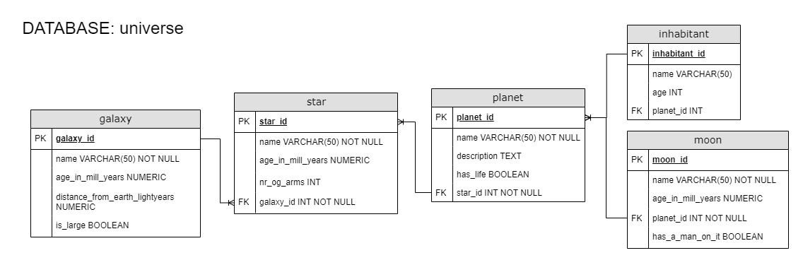

# Build a Celestial Bodies Database
This project is part of a Relational Database course on **freecodecamp.org**.  
([Relational database learning path](https://www.freecodecamp.org/learn/relational-database))

> **Short project description from FreeCodeCamp:**  
*"For this project, you will build a database of celestial bodies using PostgreSQL."*
([Course site](https://www.freecodecamp.org/learn/relational-database/build-a-celestial-bodies-database-project/build-a-celestial-bodies-database))

---

In this little project, I used what I have learned about building a PostgreSQL database to create a Celestial Bodies Database. 

| Files | Description  |
| --- | --- |
| **`universe.sql`** | A dump of the database I created. Due to my lack of interest in outer space, the database contains a mix of real, untraditional and fictional celestial bodies. |
| **`universe_erd.jpg`** | An entity relationship diagram showing the tables in the universe database, and relationships between the tables. Created with [draw.io](draw.io).|
|

